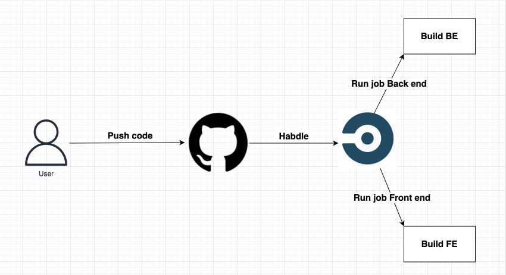

# Infrastructure Description

## Infrastructure Diagram:

#### RDS: 
Store the database via: `database-1.cp6kbspwnz97.us-east-1.rds.amazonaws.com`

#### Elastic Beanstalk:
Deploy BE API and connect to RDS to get the data via: `http://udagram-api-dev.us-east-1.elasticbeanstalk.com `

#### S3 bucket:
Host the FE website, it connect to the EB to get API BE and user can access S3 to get the application via: `http://myawsbucket-nhanhh3.s3-website-us-east-1.amazonaws.com`
